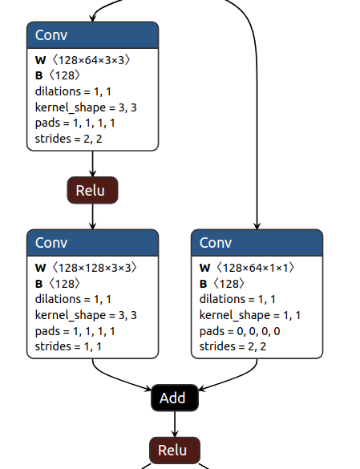
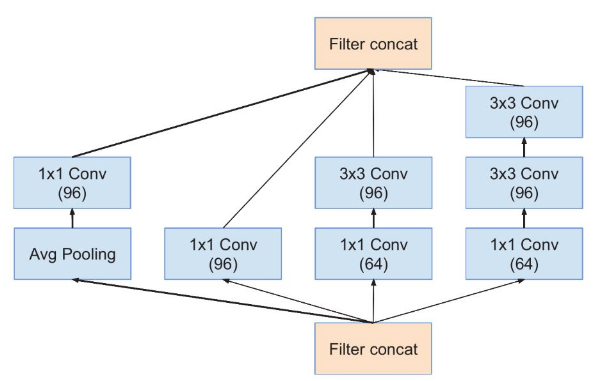

### ResNet系列网络演绎过程

​		ResNet是一个非常优秀的网络，不管在图像分类，分割和检测等领域都是非常强悍的backbone，因此，后续的研究针对ResNet的改进有很多，下面只说一下比较好的网络改进。

#### 标准ResNet

​		首先，最原始的ResNet网络结构是如下(这里用ResNet18作为例子)：

​		ResNet网络由一个stem_bloch和4个stage组成，其中在stage1中不进行downsample操作，从stage2开始，后面3个stage都进行downsample下采样，其downsample下采样模块如下图所示：

​		可以看出，其downsample主要由一个conv_3x3，stride=2的卷积和conv_1x1，Stride=2的卷积组成双路，然后Add操作而成。注意在resnet50， 101和152网络中，其下采样模块如下图所示：

​			上述就是标准的ResNet网络结构图，下面就是各种对其改进了。

#### ResNet-B

​		后续对其有一系列的改进操作，首先是其下采样模块(resnet50,101,152)，可以发现其下采样模块中，PathA的第一步操作conv_1x1，stride=2，这里就有人指出，会造成3/4的信息丢失，因此就提出将PathA中的conv_1x1的stride=2这个步长挪到后面的conv_3x3，ResNet演绎成了ResNet-B结构，如下图所示：

#### ResNet-C

​		ResNet-C主要是对stem_block进行改进，使用3个conv_3x3的卷积来替换conv_7x7的卷积。并且第一个卷积的stride=2，channel=32，中间卷积stride=1，channel=32，最后一个卷积stride=1，channel=64。这样做主要原因是一方面，减少参数量，且当输入分辨率比较小时更有利于特征提取，另一方面，增加网络的非线性能力，结构如下图所示：

#### ResNet-D

​		在ResNet-B的启发下，下采样的右边通道同样存在着忽略3/4信息的问题，因此进行改进。**既然主通道可以通过修改stride来降低信息损失，那么short-cut为什么不可以呢？**，因此，就对downsample的另外一个分支进行改进，直接在PathB上的conv_1x1卷积之前加一个AvgPool_2x2(如果改成MaxPool_2x2会不会更好呢)，结构如下图所示：

#### SE-ResNet

​		SE-ResNet是在ResNet基础上引入注意力机制，首先我们看下SE模块的具体形式：

​		SE可以实现注意力机制最重要的两个地方一个是**全连接层**，另一个是**相乘特征融合**，**假设输入图像H×W×C，通过global pooling+FC层，拉伸成1×1×C，然后再与原图像相乘，将每个通道赋予权重**。在去噪任务中，将每个噪声点赋予权重，自动去除低权重的噪声点，保留高权重噪声点，提高网络运行时间，减少参数计算。这也就是SE模块具有attention机制的原因。

​		将SE模块插入到ResNet和incption中，其基本形式如下：

|  |  |
| --------------------- | ------------------ |
| se-inception block    | se-resnet block    |

​		 可以看到SE module被apply到了residual branch上。我们首先将特征维度降低到输入的1/r，然后经过ReLu激活后再通过一个Fully Connected 层升回到原来的维度。这样做比直接用一个Fully Connected层的好处在于：1）具有更多的非线性，可以更好地拟合通道间复杂的相关性；2）极大地减少了参数量和计算量。然后通过一个Sigmoid的门获得0~1之间归一化的权重，最后通过一个Scale的操作来将归一化后的权重加权到每个通道的特征上，在Addition前对分支上Residual的特征进行了特征重标定。如果对Addition后主支上的特征进行重标定，由于在主干上存在0~1的sigmoid操作，在网络较深BP优化时就会在靠近输入层容易出现梯度消散的情况，导致模型难以优化。

#### ResNext

​		ResNext是继续在ResNet的基础上，引入Inception的思想，引入多路卷积并行的方式，但是ResNext的每个分支都采用的相同的拓扑结构，也即用的是相同大小的卷积核，具体如下图所示：

|  |  |  |
| --------------------- | ------------------------ | ---------------------- |
| ResNet Block          | Inception Block          | ResNext Block          |

这里，对ResNext的Block有等价变换形式(这里的等价变换推演过程，没有搞明白，后续请高人指点)，如下图所示，最终的Block形式是(c)，也即可以直接用一个分组卷积进行等价替换。

#### ShuffleNet v1

​	一般将FLOPs(floating point operations)作为网络结构设计的计算复杂度间接测量，然而，直接度量（例如，速度）还取决于诸如存储器访问成本和平台特性的其他因素。因此，这项工作建议评估目标平台上的直接度量，而不仅仅考虑FLOPs，这里需要区分两个指标：

**FLOPS**：floating point operations per second，指每秒浮点运算次数，可以理解为计算的速度。是衡量硬件性能的一个指标。(硬件)

**FLOPs**：floating point operations; 指浮点运算数，理解为计算量。可以用来衡量算法/模型的复杂度。(模型) ，在论文中1 GFLOPs = 10^9 FLOPs.

​		作者认为FLOPs是一种简介的测量指标，是一个近似值，并不是我们真正关心的。我们需要的是直接的指标，比如速度和延迟，作者通过实验分析发现，具有相似的FLOPs的网络，执行的速度却不一样，有的相差还挺大，具体对比如下图所示。因此，**使用FLOP作为计算复杂度的唯一指标是不充分的**。

		

图c是经典小网络在GPU上的MFLOPs与速度（Batches/sec）的关系。 图d是经典小网络在ARM上的MFLOPs与速度（Batches/sec）的关系。

​		那为什么不能只用FLOPs作为指标呢？具体有以下几个原因：

1. FLOPs没有考虑几个对速度有相当大影响的重要因素；

2. 计算平台不同。

​		FLOPs没有考虑几个对速度有相当大影响的因素：MAC(内存访问成本)和并行度。

​		比如：MAC(内存访问成本)，计算机在进行计算时候要加载到缓存中，然后再计算，这个加载过程是需要时间的。其中，分组卷积（group convolution）是对MAC消耗比较多的操作。

​		模型的并行度对速度也有很大影响，在相同的FLOPs下，具有高并行度的模型可能比具有低并行度的另一个模型快得多。如果网络的并行度较高，那么速度就会有显著的提升。

​		不同的运行平台，得到的FLOPs也不相同。有的平台会对操作进行优化，比如：cudnn加强了对3×3conv计算的优化。这样一来，不同平台的FLOPs大小确实没有什么说服力。

​		通过上述分析，作者提出了2条网络执行效率对比的设计准则：

1. 使用直接度量方式如速度替换FLOPs;

2. 要在目标计算平台上计算，不然结果不具有代表性。

   同时，作者通过一系列实验，提出了4个高效的网络结构设计指南：

①. 当conv层输入输出具有相同channel的时候，内存消耗是最小的；

②. 过多的分组卷积操作会增大MAC，从而使模型速度变慢；

③. 模型中的分支数量越少，模型速度越快;

④. Element-wise(**Add/Relu/short-cut/depthwise convolution等**)操作不能被忽略。

上述这部分具体细节请参看：https://zhuanlan.zhihu.com/p/67009992

​		shuffleNet是在ResNext基础上做的改进，观察和分析ResNext的基本block单元，其1*1 conv的计算量占据了很大一部分，并且，还注意到一个事实，分组卷积其通道之间的信息没有进行融合，基于上述问题，提出了shufflenet单元，如下图所示：

​		上图左侧为基本的ResNext的Block单元，其中3x3 DWConv表示的深度可分离卷积，我们知道Group Conv是介于普通卷积和DWConv之间，当group=1时，为标准卷积，当group为输入特征图的通道数时，则为DWConv，这里的3x3 DWConv实际上指的是Group Conv。

​		上述中间的结构即为ShuffleNet基本单元，其中将1x1 Conv变成Gconv，从而降低其计算量，然后，在3x3 DWConv单元之前增加Channel Shuffle模块，上述右侧的图为带有下采样的ShuffleNet基本单元。

#### ShuffleNet v2

​		仔细观察shuffleNet v1，发现违背了网络高效运行的规则②和③。两个1x1 GConv增加了MAC成本，同时，分组过多，导致了模型效率降低，此外，其瓶颈结构违背了G1，网络粒度太细违背了G3。为了实现较高的模型容量和效率，关键问题是如何保持大量且同样宽的通道，既没有密集卷积也没有太多的分组。Add操作是元素级加法操作也不可取违反了G4。因此，为了实现较高的模型容量和效率，关键问题是如何保持大量且同样宽的通道，既没有密集卷积也没有太多的分组。

​		针对上述问题，作者引入了**channel split**单元，其如下图所示：

|  |  |
| :------------------: | :------------------: |
|    shuffleNet V1     |    shuffleNet V2     |

可以看出下述几点：

①. 在每个单元的开始，通过Channel split将c特征通道的输入被分为两支(在这里我们能想到CSPNet也有类似的操作)，分别带有 c−c'个 和c'个通道。**按照准则G3，一个分支的结构仍然保持不变**。另一个分支由三个卷积组成， **为满足G1，令输入和输出通道相同**。与 ShuffleNet V1 不同的是，两个 1×1 卷积不再是组卷积(GConv)，因为Channel Split分割操作已经产生了两个组；

②. 卷积之后，把两个分支拼接(Concat)起来，从而通道数量保持不变 (G1)，而且也没有Add操作(element-wise操作)，因此，没有违背G4。然后进行与ShuffleNetV1相同的Channel Shuffle操作来保证两个分支间能进行信息交流；

③. depthwise convolution保留。

​		上述构建模块被重复堆叠以构建整个网络，被称之为 ShuffleNet V2。基于上述分析，本文得出结论：由于对上述四个准则的遵循，shuffleNetV2架构设计非常的高效。

​		论文中，从FLOPs、精度、速度上进行详细对比。实验中不少结果都和前面几点发现吻合，比如MobileNet v1在GPU上速度最快，主要使用了DW卷积以及逐点卷积，使得网络结构简单，没有太多复杂的支路结构，符合G3；IGCV2和IGCV3因为group操作较多（违反G2），所以整体速度较慢；最后的几个通过自动搜索构建的网络结构，和前面的第3点发现对应，因为支路较多，所以速度较慢，符合G3的标准，另外IGCV2与IGCV3的速度较慢主要是因为使用了较多的group。

​		最后，我们来看看带有SE模块和残差结构的ShuffleNet V2其基本结构是怎样的，如下图所示：

​		左侧是shuffleNet带有残差结构的模块单元，中间是ShuffleNet带有SE模块的单元，右边是将SE模块和残差结构均融合到shuffleNet中的结构示意图。

#### ResNeSt(后期重点看看)

​		ResNeSt可以说是集成了Inception，ResNext和SENet等诸多网络的特点，可以被归结为：

- **Inception**采用了**Multi-path**机制，其中每个网络块均由不同的卷积kernels组成。

- **ResNeXt**在ResNet bottle模块中采用**组卷积**(Group Convolution)，将multi-path结构转换为统一操作。

- **SE-Net** 通过自适应地重新校准通道特征响应来引入**通道注意力（channel-attention）机制**。

- **SK-Net** 通过两个网络分支引入**特征图注意力（feature-map attention）**。

  SE-Block、SK-Net Block和ResNeSt Block如下图所示：

  |  |   |  |
  | ----------- | ------------ | ----------------- |
  | SE-Block    | SK-Net Block | ResNest Block     |

  其split Attention模块如下图所示：

  

  参考文献：https://zhuanlan.zhihu.com/p/133805433

  #### Res2Net

  ​		Res2Net主要从特征分层的角度出发，指出大多数现有方法以分层的方式表示多尺度特征，然而其Res2Net则另辟蹊径，是在单个残差块内构造具有等级制的类似残差连接，**Res2Net在粒度级别表示多尺度特征(也即在res_block中)，并增加了每个网络层的感受野。**Res2Net的block如下图所示：

  

  ​		通俗的理解，就是将原来的resnet中间的3x3卷积换成了右侧红色部分，该部分最少是不经过3x3卷积，直接连接。最多会经过3个3x3的卷积，这样就能理解感受野比原结构多的原因了。再来讲一下里面的结构，经过1x1卷积之后，将特征图分成4部分。第一部分线路很简单，x1不做处理，直接传到y1；第二部分线路，x2经过3x3卷积之后分为两条线路，一条继续向前传播给y2，另一条传到x3，这样第三条线路就获得了第二条线路的信息；第三条线路、第四条线路，以此类推。每条线路的通道数为n/s。

  #### RegNet

  ​		RegNet的核心思想是提出了对网络设计空间进行整体估计(population estimation，意思就是所有的深度宽度之类的最佳设计空间关系给它估计出来)，得到深度(depth)，宽度(width)等等一系列网络设计要素关于网络设计目标的函数关系，那么我们就很轻松地知道大概多深的网络，多宽的网络是最佳选择。

  ​		给定输入图像，接下来是一个包含简单主干的网络，再接下来是执行大量计算的网络主体，最后是预测输出类别的网络头。本文保持主干和头部网络尽可能简单，主要关注网络网络主体的结构。可以看到这里网络主体由4个阶段(stage)组成，并且分辨率逐渐降低，然后每个stage里面又是由一系列相同的块(block)组成。在这个结构里面，可以改变的参数包括块的数量d_i，块的宽度w_i等，这里就完整展示了AnyNet的结构。

  

  ​		实际上，寻找网络设计空间的函数关系就是建模每个Stage的每个Block应该多深以及多宽的关系，这里Regnet选择的Block是ResNext的Block结构，最终得到的函数关系是：u_j = w_0 + w_a * j，其中j∈[0, depth-1]，depth为网络深度(网络层数)，w_0为初始化宽度(channels)，w_a表示斜率，通过这个关系，就可以得到每一层的Block的宽度为多少，然后经过量化(让每个stage的block的宽度相等)，网络结构就可以被设计出来。

  

