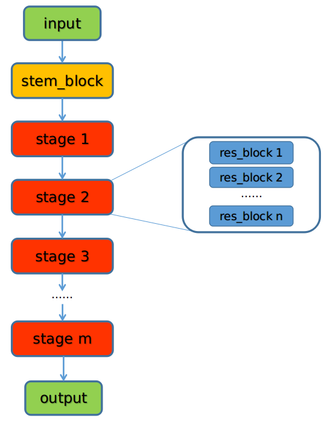
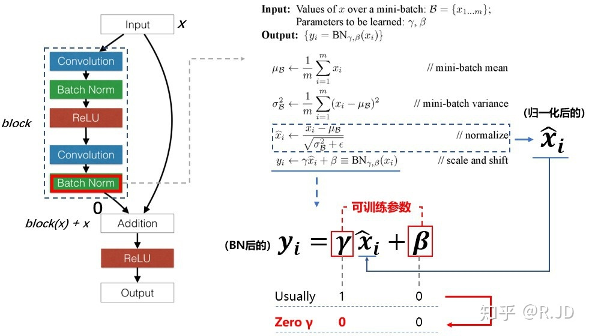

## ResNet系列代码说明

### 0. 总论		

​		mmdetection和mmclassification中的诸多Backbone比如：ResNext，ResNest，Res2Net，RegNet等，可以发现均继承了ResNet类。首先，重点说下ResNet类的构成，以及最终如何构建出ResNet。我们知道，不管是ResNet还是及其所有变种系列，其总的网络架构都是如下结构，可以看出，ResNet系列网络结构均由一个stem_block模块和m个stage阶段下的res_blocks组成。



### 1. 参数说明

首先，看下ResNet类的各个参数说明：

```python
class ResNet(nn.Module):
    """ResNet backbone.

    Args:
        depth (int): Depth of resnet, from {18, 34, 50, 101, 152}.
        in_channels (int): Number of input image channels. Default: 3.
        stem_channels (int): Number of stem channels. Default: 64.
        base_channels (int): Number of base channels of res layer. Default: 64.
        num_stages (int): Resnet stages. Default: 4.
        strides (Sequence[int]): Strides of the first block of each stage.
        dilations (Sequence[int]): Dilation of each stage.
        out_indices (Sequence[int]): Output from which stages.
        style (str): `pytorch` or `caffe`. If set to "pytorch", the stride-two
            layer is the 3x3 conv layer, otherwise the stride-two layer is
            the first 1x1 conv layer.
        deep_stem (bool): Replace 7x7 conv in input stem with 3 3x3 conv
        avg_down (bool): Use AvgPool instead of stride conv when
            downsampling in the bottleneck.
        frozen_stages (int): Stages to be frozen (stop grad and set eval mode).
            -1 means not freezing any parameters.
        norm_cfg (dict): Dictionary to construct and config norm layer.
        norm_eval (bool): Whether to set norm layers to eval mode, namely,
            freeze running stats (mean and var). Note: Effect on Batch Norm
            and its variants only.
        plugins (list[dict]): List of plugins for stages, each dict contains:

            - cfg (dict, required): Cfg dict to build plugin.
            - position (str, required): Position inside block to insert
              plugin, options are 'after_conv1', 'after_conv2', 'after_conv3'.
            - stages (tuple[bool], optional): Stages to apply plugin, length
              should be same as 'num_stages'.
        with_cp (bool): Use checkpoint or not. Using checkpoint will save some
            memory while slowing down the training speed.
        zero_init_residual (bool): Whether to use zero init for last norm layer
            in resblocks to let them behave as identity.

    Example:
        >>> # from core.models import ResNet
        >>> import torch
        >>> self = ResNet(depth=18)
        >>> self.eval()
        >>> inputs = torch.rand(1, 3, 32, 32)
        >>> level_outputs = self.forward(inputs)
        >>> for level_out in level_outputs:
        ...     print(tuple(level_out.shape))
        (1, 64, 8, 8)
        (1, 128, 4, 4)
        (1, 256, 2, 2)
        (1, 512, 1, 1)
    """

    arch_settings = {
        18: (BasicBlock, (2, 2, 2, 2)),
        34: (BasicBlock, (3, 4, 6, 3)),
        50: (Bottleneck, (3, 4, 6, 3)),
        101: (Bottleneck, (3, 4, 23, 3)),
        152: (Bottleneck, (3, 8, 36, 3))
    }

    def __init__(self,
                 depth, 
                 in_channels=3,
                 stem_channels=64,
                 base_channels=64,
                 num_stages=4,
                 strides=(1, 2, 2, 2),
                 dilations=(1, 1, 1, 1),
                 out_indices=(0, 1, 2, 3),
                 style='pytorch',
                 deep_stem=False,
                 avg_down=False,
                 frozen_stages=-1,
                 conv_cfg=None,
                 norm_cfg=dict(type='BN', requires_grad=True),
                 norm_eval=True,
                 dcn=None,
                 stage_with_dcn=(False, False, False, False),
                 plugins=None,
                 with_cp=False,
                 zero_init_residual=True):
```

其中，大部分参数都有详细的英文介绍，这里就不在重复，这里重点介绍几个参数：

stem_channels：经过stem_block模块后，特征图的通道维度，stem_block模块由_make_stem_layer()函数构建。

base_channels：进入stage_1阶段开始，res_block中res_layer层的通道维度的基倍数。

num_stages：由上图所示，总的红色模块(stage)个数，一般都是4个阶段。

strides：每个stage中的第一个res_block下的卷积核(具体来说是res_block中的第一个卷积核)的步长。

dilations：每个stage中卷积核的空洞率。

out_indices：指定哪些stage的结果输出的索引；

deep_stem：将stem_block模块中的7*7换成3个3x3的卷积，在代码中也可以看出，当将deep_stem开启为True时，ResNet将演变成ResNetV1c结构，后续会详细讲解ResNet系列网络结构的进化过程；

avg_down：使用AvgPool代替res_block中stride=2的卷积模块，当将deep_stem和avg_down都开启为True时，其ResNet将演变成ResNetVD结构。

frozen_stages：指定哪些stage，不进行参数更新，设置成eval mode；

norm_eval：设置backbone的BN层成eval模式。

zero_init_residual (bool)：是否将resblock中最后一个BN层的γ参数设置为0，这里主要涉及到一个训练技巧，在《 Bag of Tricks for Image Classification with CNNs》中，将所有残差块中的最后一个BN中的初始化设置成0，也即残差块的输出等于输入，相当于 模型的网络层数较少， 可以使得模型在初始化阶段更容易训练，具体如下图所示：



### 2. 网络构建

​		纵观整个ResNet类，很容易可以看出，可以发现构建网络结构的核心语句为：

```python
①：self._make_stem_layer(in_channels, stem_channels)   # 构建stem_block模块
②：for i, num_blocks in enumerate(self.stage_blocks):  # 构建每个stage阶段的num_blocks个resblock模块
    	res_layer = self.make_res_layer(self.block,num_blocks,...)
```

​		其中make_stem_layer函数很好理解，这里主要分析下res_layer = self.make_res_layer(self.block, ...)的具体构建，res_layer的构建主要由参数self.stage_blocks和self.block决定，这两个参数的获得来源于代码：self.block, stage_blocks = self.arch_settings[depth]，其中self.arch_settings为类成员，ResNet系列的arch_settings成员变量为：

```python
arch_settings = {
    18: (BasicBlock, (2, 2, 2, 2)),
    34: (BasicBlock, (3, 4, 6, 3)),
    50: (Bottleneck, (3, 4, 6, 3)),
    101: (Bottleneck, (3, 4, 23, 3)),
    152: (Bottleneck, (3, 8, 36, 3))
}
```

​		我们继续来看看self.make_res_layer()这个函数具体做了什么呢？其代码如下：

```python
def make_res_layer(self, **kwargs):
    """Pack all blocks in a stage into a ``ResLayer``"""
    return ResLayer(**kwargs)
```

​		其中ReLayer()代码如下：

```python
class ResLayer(nn.Sequential):
    """ResLayer to build ResNet style backbone.
    """

    def __init__(self,
                 block,
                 inplanes,
                 planes,
                 num_blocks,
                 stride=1,
                 avg_down=False,
                 conv_cfg=None,
                 norm_cfg=dict(type='BN'),
                 downsample_first=True,
                 **kwargs):
        self.block = block
		# build downsample block
        if downsample_first:
            layers.append(
                block(
                    inplanes=inplanes,
                    planes=planes,
                    stride=stride,
                    downsample=downsample,
                    conv_cfg=conv_cfg,
                    norm_cfg=norm_cfg,
                    **kwargs))
            inplanes = planes * block.expansion
            # repeat res_blocks
            for _ in range(1, num_blocks):
                layers.append(
                    block(
                        inplanes=inplanes,
                        planes=planes,
                        stride=1,
                        conv_cfg=conv_cfg,
                        norm_cfg=norm_cfg,
                        **kwargs))

        super(ResLayer, self).__init__(*layers)
```

​		ResLayer类的代码比较多，我们只看下核心部分，可以发现，ResLayer就是根据block和num_blocks构建stage，假设我们构建ResNet18网络，通过depth参数可以得到self.block, stage_blocks = self.arch_settings[18]，其block为BasicBlock类，网络总共4个stage，每个stage中包含两个实例化的BasicBlock成员，通过将这些参数传递给ResLayer，即可创建出ReNet18网络。

​		既然知道ResNet18,34,50...等网络的构建之后，那现在如果我要构建一个比如ResNext网络该如何构建呢？我们知道ResNext的总体网络架构是遵循ResNet网络系列的，也即由stem_block和m个stage构成，每个stage下有n个res_block(比如ResNet18中每个stage下包含2个BasicBlock)。那构建ResNext网络，应该就只需要替换ResNet类中的self.arch_settings变量即可了呢，事实上也确实基本上是这样。但是，在一些细节上，可能传递给make_res_layer()参数不同，我们需要重写ResNet中 make_res_layer()方法，因此，ResNext的类代码可以写成如下形式就可以了：

```Python
class ResNeXt(ResNet):

    arch_settings = {
        50: (Bottleneck, (3, 4, 6, 3)),
        101: (Bottleneck, (3, 4, 23, 3)),
        152: (Bottleneck, (3, 8, 36, 3))
    }

    def __init__(self, groups=1, width_per_group=4, **kwargs):
        self.groups = groups
        self.base_width = width_per_group
        super(ResNeXt, self).__init__(**kwargs)

    def make_res_layer(self, **kwargs):
        """Pack all blocks in a stage into a ``ResLayer``"""
        return ResLayer(
            groups=self.groups,
            base_width=self.base_width,
            base_channels=self.base_channels,
            **kwargs)
```

​		其他诸如：Res2Net代码也和ResNext代码几乎一样，只是类初始化函数中部分变量不同而已，以上部分就是mmdetection和mmclassification中关于ResNet网络系列的构建代码说明。